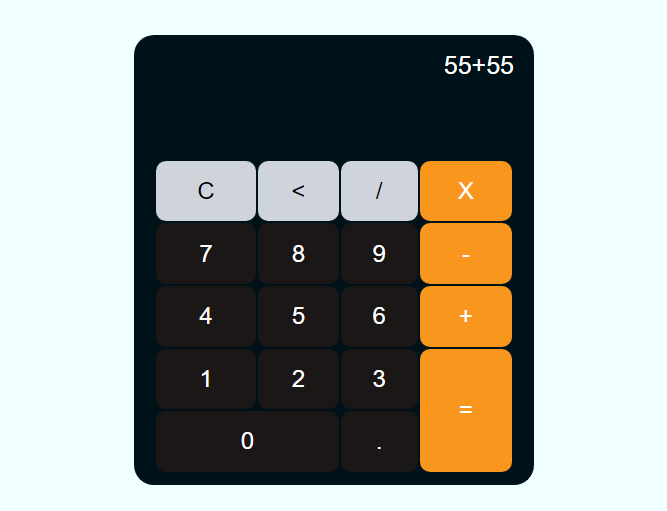

# Calculadora

## 📝 Descrição

Calculadora para contas simples, Desenvolvida por [Gustavo Neitzke](https://www.youtube.com/c/GustavoNeitzke) e replicada por mim,com algumas diferenças no design.

Eu fiz essa calculadora no intuito de aprender mais sobre Javascript,e acho que deu pra entender melhor algumas coisa com apenas esse projeto simples.

Para acessar o site clique [aqui](https://jeanaraga.github.io/Calculadora/)

## 📚 Linguagens

- HTML
- CSS
- Javascript

## 🛠 Ferramentas e Sites Auxiliadores

- VSCode
- Github Desktop
- Youtube
- Coolors

## ⚙️ Ajustes e Melhorias

Projeto concluido✅

## 👨🏾‍💻 Feito por 

<table>
  <tr>
    <td align="center">
    <a href="#">
         
        
          <b>Jean Pedro</b>
        
      </a>
    </td>
  </tr>
</table>

